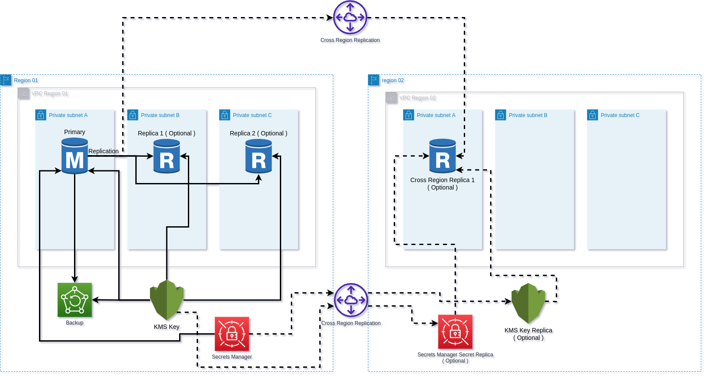

## Usage
**IMPORTANT:** Always include the providers block in your module. The providers will need to be defined in the `_providers.tf` file. For a full deployment example see 
[complere example](./examples/complete/) folder.

A basic deployment would look like the following.

```hcl
module "psql-dev" {
  # Please update the version reference to match a tag
  source = "git@github.com:davespe/terraform-modules.git//modules/service/postgres-aws/v01/psqlcluster?ref=vx.xx.x"

  context = module.this_ue1.context
  enabled = true

  providers = {
    aws         = aws.ue1
    aws.region2 = aws.uw2
  }

  kms_multi_region = false

  name                             = "rds-cluster"
  instance_type                    = "db.t3.large"
  replica_count                    = 0
  engine_version                   = "13.4"
  db_name                          = "test_db"
  allocated_storage                = 1
  vpc_id                           = "vpc-xxxxxxxxxxx"
  subnets                          = ["subnet-xxxxxxxx","subnet-yyyyyyyy","subnet-zzzzzzzz"]
}
```
<br>

### Cross Region Replication
Cross region replication is handled by the `disaster_recovery` variable in the module. 
When set to `true`; the Secrets manager secret, KMS Key, and a single db instance will be replicated to the region of your choosing, as defined in `_providers.tf` and set in the providers block in the module. See [Complete Deployment Example](./examples/complete/) for more information.
Additionally for this to work the `kms_multi_region` variable needs to set to `true` as well, which is the default value for said variable, so you can omit the variable all together. 

Oven though there is only one cross region replica being deployed and only requires a single subnet, in order for the subnet group to be deployed you need to specify `two` subnet ids to the `subnets_cross_region` variable otherwise deployment fails.
<br><br>

### Backups
Be aware that backups are taken from the first read replica, so that we may avoid unnecessary processing overhead on the main write instance. As such if you need backups you will need one read replica.
<br><br>

### PSQL Parameters
For postgres certain db parameters require a restart and apply method should be set to `pending-reboot`, and others don't and can be set to either `pending-boot` or `immediately`.
If you choose `immediately` for a db parameter which requires restart which has an apply method of `pending-boot`, each subsequent run will try and make changes to your database.

To find out which parameters require which apply method please navigate to [POSTGRESQLCO.NF](https://postgresqlco.nf/doc/en/param/).
Type in the parameter name and look for `Parameter Info.Restart`, when true = `pending-reboot`, when false = `immediately`.
Having said this, RDS can and does do things a bit different and the above doesn't always reflect RDS behavior. The best way to determine the apply method in RDS sometimes is to just run the code with terraform and change it to what Terraform desires.

It is also necessary that you add the `shared_preload_libraries` parameter with `pg_stat_statements` otherwise you can not inspect queries.
Use the default value of `"auto_explain, pg_hint_plan, pg_prewarm, pg_stat_statements"`.
<br>

#### Parameters example
```hcl
  ...
  db_parameter = [
    {
      apply_method = "pending-reboot"
      name         = "shared_preload_libraries"
      value        = "auto_explain, pg_hint_plan, pg_prewarm, pg_stat_statements"
    },
    {
      apply_method = "pending-reboot"
      name         = "autovacuum_analyze_scale_factor"
      value        = "0.05"
    },
    {
      apply_method = "immediate"
      name         = "application_name"
      value        = "test"
    }
  ]

  db_parameter_replicas = [
    {
  ...
```
<br>

## Post deployment

You will need to run the database creation process after the deployment. 

The original [Confluence article](https://smartpager.atlassian.net/wiki/spaces/O/pages/1432551474/Database+creation+process) has the full process described there.

Use a command line application such as `pwgen -n1 <number-of-characters>` to generate the passwords for the creation process and store them in AWS Secrets Manager.
<br>

## Diagram




<!-- BEGIN_TF_DOCS -->
## Requirements

| Name | Version |
|------|---------|
| <a name="requirement_terraform"></a> [terraform](#requirement\_terraform) | >= 0.13.0 |
| <a name="requirement_aws"></a> [aws](#requirement\_aws) | >= 3.0 |
| <a name="requirement_helm"></a> [helm](#requirement\_helm) | ~> 2.6.0 |
| <a name="requirement_kubernetes"></a> [kubernetes](#requirement\_kubernetes) | ~> 2.13.0 |
| <a name="requirement_null"></a> [null](#requirement\_null) | >= 2.0 |

## Providers

| Name | Version |
|------|---------|
| <a name="provider_aws"></a> [aws](#provider\_aws) | >= 3.0 |
| <a name="provider_aws.region2"></a> [aws.region2](#provider\_aws.region2) | >= 3.0 |
| <a name="provider_random"></a> [random](#provider\_random) | n/a |

## Modules

| Name | Source | Version |
|------|--------|---------|
| <a name="module_aws_utils"></a> [aws\_utils](#module\_aws\_utils) | cloudposse/utils/aws | 0.8.1 |
| <a name="module_replica_backup"></a> [replica\_backup](#module\_replica\_backup) | cloudposse/backup/aws | 0.13.1 |
| <a name="module_this"></a> [this](#module\_this) | cloudposse/label/null | 0.25.0 |
| <a name="module_this_gbl"></a> [this\_gbl](#module\_this\_gbl) | cloudposse/label/null | 0.25.0 |
| <a name="module_this_kms_key"></a> [this\_kms\_key](#module\_this\_kms\_key) | cloudposse/kms-key/aws | 0.12.1 |
| <a name="module_this_rds_instance_r01"></a> [this\_rds\_instance\_r01](#module\_this\_rds\_instance\_r01) | cloudposse/rds/aws | 0.40.0 |
| <a name="module_this_region_01"></a> [this\_region\_01](#module\_this\_region\_01) | cloudposse/label/null | 0.25.0 |
| <a name="module_this_region_02"></a> [this\_region\_02](#module\_this\_region\_02) | cloudposse/label/null | 0.25.0 |

## Resources

| Name | Type |
|------|------|
| [aws_db_instance.cross_region_replica](https://registry.terraform.io/providers/hashicorp/aws/latest/docs/resources/db_instance) | resource |
| [aws_db_instance.replicas](https://registry.terraform.io/providers/hashicorp/aws/latest/docs/resources/db_instance) | resource |
| [aws_db_parameter_group.cross_region_replica](https://registry.terraform.io/providers/hashicorp/aws/latest/docs/resources/db_parameter_group) | resource |
| [aws_db_parameter_group.replicas](https://registry.terraform.io/providers/hashicorp/aws/latest/docs/resources/db_parameter_group) | resource |
| [aws_db_subnet_group.cross_region_replica](https://registry.terraform.io/providers/hashicorp/aws/latest/docs/resources/db_subnet_group) | resource |
| [aws_iam_policy.this_rds_instance_r01_monitoring](https://registry.terraform.io/providers/hashicorp/aws/latest/docs/resources/iam_policy) | resource |
| [aws_iam_role.this_rds_instance_r01_monitoring](https://registry.terraform.io/providers/hashicorp/aws/latest/docs/resources/iam_role) | resource |
| [aws_kms_alias.r02_kms_key](https://registry.terraform.io/providers/hashicorp/aws/latest/docs/resources/kms_alias) | resource |
| [aws_kms_replica_key.r02_kms_key](https://registry.terraform.io/providers/hashicorp/aws/latest/docs/resources/kms_replica_key) | resource |
| [aws_secretsmanager_secret.this_rds_cluster_pass_region_01](https://registry.terraform.io/providers/hashicorp/aws/latest/docs/resources/secretsmanager_secret) | resource |
| [aws_secretsmanager_secret_version.this_rds_cluster_pass_region_01](https://registry.terraform.io/providers/hashicorp/aws/latest/docs/resources/secretsmanager_secret_version) | resource |
| [aws_security_group.cross_region_replica](https://registry.terraform.io/providers/hashicorp/aws/latest/docs/resources/security_group) | resource |
| [random_password.rdscluster_default](https://registry.terraform.io/providers/hashicorp/random/latest/docs/resources/password) | resource |
| [aws_caller_identity.this_region_01](https://registry.terraform.io/providers/hashicorp/aws/latest/docs/data-sources/caller_identity) | data source |
| [aws_caller_identity.this_region_02](https://registry.terraform.io/providers/hashicorp/aws/latest/docs/data-sources/caller_identity) | data source |
| [aws_iam_policy_document.kms_access_policy](https://registry.terraform.io/providers/hashicorp/aws/latest/docs/data-sources/iam_policy_document) | data source |
| [aws_iam_policy_document.kms_access_policy_r02](https://registry.terraform.io/providers/hashicorp/aws/latest/docs/data-sources/iam_policy_document) | data source |
| [aws_iam_policy_document.this_rds_instance_r01_monitoring_assume_role_policy](https://registry.terraform.io/providers/hashicorp/aws/latest/docs/data-sources/iam_policy_document) | data source |
| [aws_iam_policy_document.this_rds_instance_r01_monitoring_policy](https://registry.terraform.io/providers/hashicorp/aws/latest/docs/data-sources/iam_policy_document) | data source |
| [aws_region.this_region_01](https://registry.terraform.io/providers/hashicorp/aws/latest/docs/data-sources/region) | data source |
| [aws_region.this_region_02](https://registry.terraform.io/providers/hashicorp/aws/latest/docs/data-sources/region) | data source |

## Inputs

| Name | Description | Type | Default | Required |
|------|-------------|------|---------|:--------:|
| <a name="input_additional_tag_map"></a> [additional\_tag\_map](#input\_additional\_tag\_map) | Additional key-value pairs to add to each map in `tags_as_list_of_maps`. Not added to `tags` or `id`.<br>This is for some rare cases where resources want additional configuration of tags<br>and therefore take a list of maps with tag key, value, and additional configuration. | `map(string)` | `{}` | no |
| <a name="input_allocated_storage"></a> [allocated\_storage](#input\_allocated\_storage) | The allocated storage in GBs | `number` | `50` | no |
| <a name="input_attributes"></a> [attributes](#input\_attributes) | ID element. Additional attributes (e.g. `workers` or `cluster`) to add to `id`,<br>in the order they appear in the list. New attributes are appended to the<br>end of the list. The elements of the list are joined by the `delimiter`<br>and treated as a single ID element. | `list(string)` | `[]` | no |
| <a name="input_auto_minor_version_upgrade"></a> [auto\_minor\_version\_upgrade](#input\_auto\_minor\_version\_upgrade) | Update minor versions of the database automatically. | `bool` | `true` | no |
| <a name="input_backup_copy_action_cold_storage_after"></a> [backup\_copy\_action\_cold\_storage\_after](#input\_backup\_copy\_action\_cold\_storage\_after) | Days after which backups will be moved into cold storage. | `number` | `30` | no |
| <a name="input_backup_schedule_cron"></a> [backup\_schedule\_cron](#input\_backup\_schedule\_cron) | AWS backup schedule time. See https://docs.aws.amazon.com/AmazonCloudWatch/latest/events/ScheduledEvents.html?icmpid=docs_console_unmapped | `string` | `"cron(0 6 * * ? *)"` | no |
| <a name="input_context"></a> [context](#input\_context) | Single object for setting entire context at once.<br>See description of individual variables for details.<br>Leave string and numeric variables as `null` to use default value.<br>Individual variable settings (non-null) override settings in context object,<br>except for attributes, tags, and additional\_tag\_map, which are merged. | `any` | <pre>{<br>  "additional_tag_map": {},<br>  "attributes": [],<br>  "delimiter": null,<br>  "descriptor_formats": {},<br>  "enabled": true,<br>  "environment": null,<br>  "id_length_limit": null,<br>  "label_key_case": null,<br>  "label_order": [],<br>  "label_value_case": null,<br>  "labels_as_tags": [<br>    "unset"<br>  ],<br>  "name": null,<br>  "namespace": null,<br>  "regex_replace_chars": null,<br>  "stage": null,<br>  "tags": {},<br>  "tenant": null<br>}</pre> | no |
| <a name="input_crr_instance_type"></a> [crr\_instance\_type](#input\_crr\_instance\_type) | Instance type/size to use for the cross region replica. If no value is set will use the value set in 'instance\_type'. | `string` | `""` | no |
| <a name="input_db_name"></a> [db\_name](#input\_db\_name) | Database name residing inside the cluster. | `string` | n/a | yes |
| <a name="input_db_parameter"></a> [db\_parameter](#input\_db\_parameter) | A list of DB parameters to apply, 'apply\_method' is either 'immediate' or 'pending-reboot'. | <pre>list(object({<br>    apply_method = string<br>    name         = string<br>    value        = string<br>  }))</pre> | `[]` | no |
| <a name="input_db_parameter_cross_region_replca"></a> [db\_parameter\_cross\_region\_replca](#input\_db\_parameter\_cross\_region\_replca) | A list of DB parameters to apply to the cross region replica. Note that parameters may differ from a DB family to another. | <pre>list(object({<br>    apply_method = string<br>    name         = string<br>    value        = string<br>  }))</pre> | `[]` | no |
| <a name="input_db_parameter_group"></a> [db\_parameter\_group](#input\_db\_parameter\_group) | DB parameter group family. | `string` | `"postgres13"` | no |
| <a name="input_db_parameter_replicas"></a> [db\_parameter\_replicas](#input\_db\_parameter\_replicas) | A list of DB parameters to apply to the replicas. Note that parameters may differ from a DB family to another. | <pre>list(object({<br>    apply_method = string<br>    name         = string<br>    value        = string<br>  }))</pre> | `[]` | no |
| <a name="input_deletion_protection"></a> [deletion\_protection](#input\_deletion\_protection) | If the DB instance should have deletion protection enabled | `bool` | `false` | no |
| <a name="input_delimiter"></a> [delimiter](#input\_delimiter) | Delimiter to be used between ID elements.<br>Defaults to `-` (hyphen). Set to `""` to use no delimiter at all. | `string` | `null` | no |
| <a name="input_descriptor_formats"></a> [descriptor\_formats](#input\_descriptor\_formats) | Describe additional descriptors to be output in the `descriptors` output map.<br>Map of maps. Keys are names of descriptors. Values are maps of the form<br>`{<br>   format = string<br>   labels = list(string)<br>}`<br>(Type is `any` so the map values can later be enhanced to provide additional options.)<br>`format` is a Terraform format string to be passed to the `format()` function.<br>`labels` is a list of labels, in order, to pass to `format()` function.<br>Label values will be normalized before being passed to `format()` so they will be<br>identical to how they appear in `id`.<br>Default is `{}` (`descriptors` output will be empty). | `any` | `{}` | no |
| <a name="input_disaster_recovery"></a> [disaster\_recovery](#input\_disaster\_recovery) | Setting this to true will deploy a cross region replica of the database. | `bool` | `false` | no |
| <a name="input_enabled"></a> [enabled](#input\_enabled) | Set to false to prevent the module from creating any resources | `bool` | `null` | no |
| <a name="input_enabled_cloudwatch_logs_exports"></a> [enabled\_cloudwatch\_logs\_exports](#input\_enabled\_cloudwatch\_logs\_exports) | Log types to export to cloudwatch. The following log types are supported for postgres: 'postgresql', 'upgrade'. | `list(string)` | `[]` | no |
| <a name="input_engine"></a> [engine](#input\_engine) | The name of the database engine to be used for this DB cluster. | `string` | `"postgres"` | no |
| <a name="input_engine_version"></a> [engine\_version](#input\_engine\_version) | The version of the database engine to use, ex '13.4'. See `aws rds describe-db-engine-versions` | `string` | n/a | yes |
| <a name="input_environment"></a> [environment](#input\_environment) | ID element. Usually used for region e.g. 'uw2', 'us-west-2', OR role 'prod', 'staging', 'dev', 'UAT' | `string` | `null` | no |
| <a name="input_id_length_limit"></a> [id\_length\_limit](#input\_id\_length\_limit) | Limit `id` to this many characters (minimum 6).<br>Set to `0` for unlimited length.<br>Set to `null` for keep the existing setting, which defaults to `0`.<br>Does not affect `id_full`. | `number` | `null` | no |
| <a name="input_instance_type"></a> [instance\_type](#input\_instance\_type) | Instance type/size to use. | `string` | n/a | yes |
| <a name="input_iops"></a> [iops](#input\_iops) | The amount of provisioned IOPS. Setting this implies a storage\_type of 'io1'. This setting is required to create a Multi-AZ DB cluster. Check TF docs for values based on db engine | `number` | `null` | no |
| <a name="input_kms_deletion_window_in_days"></a> [kms\_deletion\_window\_in\_days](#input\_kms\_deletion\_window\_in\_days) | Duration in days after which the key is deleted after destruction of the resource | `number` | `7` | no |
| <a name="input_kms_enable_key_rotation"></a> [kms\_enable\_key\_rotation](#input\_kms\_enable\_key\_rotation) | Specifies whether key rotation is enabled | `bool` | `true` | no |
| <a name="input_label_key_case"></a> [label\_key\_case](#input\_label\_key\_case) | Controls the letter case of the `tags` keys (label names) for tags generated by this module.<br>Does not affect keys of tags passed in via the `tags` input.<br>Possible values: `lower`, `title`, `upper`.<br>Default value: `title`. | `string` | `null` | no |
| <a name="input_label_order"></a> [label\_order](#input\_label\_order) | The order in which the labels (ID elements) appear in the `id`.<br>Defaults to ["namespace", "environment", "stage", "name", "attributes"].<br>You can omit any of the 6 labels ("tenant" is the 6th), but at least one must be present. | `list(string)` | `null` | no |
| <a name="input_label_value_case"></a> [label\_value\_case](#input\_label\_value\_case) | Controls the letter case of ID elements (labels) as included in `id`,<br>set as tag values, and output by this module individually.<br>Does not affect values of tags passed in via the `tags` input.<br>Possible values: `lower`, `title`, `upper` and `none` (no transformation).<br>Set this to `title` and set `delimiter` to `""` to yield Pascal Case IDs.<br>Default value: `lower`. | `string` | `null` | no |
| <a name="input_labels_as_tags"></a> [labels\_as\_tags](#input\_labels\_as\_tags) | Set of labels (ID elements) to include as tags in the `tags` output.<br>Default is to include all labels.<br>Tags with empty values will not be included in the `tags` output.<br>Set to `[]` to suppress all generated tags.<br>**Notes:**<br>  The value of the `name` tag, if included, will be the `id`, not the `name`.<br>  Unlike other `null-label` inputs, the initial setting of `labels_as_tags` cannot be<br>  changed in later chained modules. Attempts to change it will be silently ignored. | `set(string)` | <pre>[<br>  "default"<br>]</pre> | no |
| <a name="input_maintenance_window"></a> [maintenance\_window](#input\_maintenance\_window) | Weekly time slot during which the database will go into maintenance mode for upgrades and updates, etc. | `string` | `"Mon:03:00-Mon:04:00"` | no |
| <a name="input_monitoring_interval"></a> [monitoring\_interval](#input\_monitoring\_interval) | The interval, in seconds, between points when Enhanced Monitoring metrics are collected for the DB instance. To disable collecting Enhanced Monitoring metrics, specify 0. Valid Values are 0, 1, 5, 10, 15, 30, 60. | `string` | `"0"` | no |
| <a name="input_name"></a> [name](#input\_name) | ID element. Usually the component or solution name, e.g. 'app' or 'jenkins'.<br>This is the only ID element not also included as a `tag`.<br>The "name" tag is set to the full `id` string. There is no tag with the value of the `name` input. | `string` | `null` | no |
| <a name="input_namespace"></a> [namespace](#input\_namespace) | ID element. Usually an abbreviation of your organization name, e.g. 'eg' or 'cp', to help ensure generated IDs are globally unique | `string` | `null` | no |
| <a name="input_parameter_group_name"></a> [parameter\_group\_name](#input\_parameter\_group\_name) | Name of the DB parameter group to associate with primary | `string` | `""` | no |
| <a name="input_parameter_group_name_cross_region_replica"></a> [parameter\_group\_name\_cross\_region\_replica](#input\_parameter\_group\_name\_cross\_region\_replica) | Name of the DB parameter group to associate with cross region replica. | `string` | `""` | no |
| <a name="input_parameter_group_name_replicas"></a> [parameter\_group\_name\_replicas](#input\_parameter\_group\_name\_replicas) | Name of the DB parameter group to associate with replicas. | `string` | `""` | no |
| <a name="input_performance_insights_enabled"></a> [performance\_insights\_enabled](#input\_performance\_insights\_enabled) | Specifies whether Performance Insights are enabled. | `bool` | `true` | no |
| <a name="input_performance_insights_retention_period"></a> [performance\_insights\_retention\_period](#input\_performance\_insights\_retention\_period) | The amount of time in days to retain Performance Insights data. Either 7 (7 days) or 731 (2 years). | `number` | `7` | no |
| <a name="input_regex_replace_chars"></a> [regex\_replace\_chars](#input\_regex\_replace\_chars) | Terraform regular expression (regex) string.<br>Characters matching the regex will be removed from the ID elements.<br>If not set, `"/[^a-zA-Z0-9-]/"` is used to remove all characters other than hyphens, letters and digits. | `string` | `null` | no |
| <a name="input_replica_count"></a> [replica\_count](#input\_replica\_count) | Number of DB replica instances to create in the primary cluster, this does not include the primary instance or the cross region replicas. | `number` | `0` | no |
| <a name="input_secret_recovery_window_in_days"></a> [secret\_recovery\_window\_in\_days](#input\_secret\_recovery\_window\_in\_days) | How many days after deletion can the secret be recover for, 0 for immediate deletion and no recovery. | `number` | `7` | no |
| <a name="input_skip_final_snapshot"></a> [skip\_final\_snapshot](#input\_skip\_final\_snapshot) | Skip creating a final snapshot when deleting the db instance. | `bool` | `true` | no |
| <a name="input_stage"></a> [stage](#input\_stage) | ID element. Usually used to indicate role, e.g. 'prod', 'staging', 'source', 'build', 'test', 'deploy', 'release' | `string` | `null` | no |
| <a name="input_storage_type"></a> [storage\_type](#input\_storage\_type) | One of 'standard' (magnetic), 'gp2' (general purpose SSD), or 'io1' (provisioned IOPS SSD) | `string` | `"gp2"` | no |
| <a name="input_subnets"></a> [subnets](#input\_subnets) | List of VPC subnet IDs. | `list(string)` | n/a | yes |
| <a name="input_subnets_cross_region"></a> [subnets\_cross\_region](#input\_subnets\_cross\_region) | List of VPC subnet IDs in the replication region. | `list(string)` | `[]` | no |
| <a name="input_tags"></a> [tags](#input\_tags) | Additional tags (e.g. `{'BusinessUnit': 'XYZ'}`).<br>Neither the tag keys nor the tag values will be modified by this module. | `map(string)` | `{}` | no |
| <a name="input_tenant"></a> [tenant](#input\_tenant) | ID element \_(Rarely used, not included by default)\_. A customer identifier, indicating who this instance of a resource is for | `string` | `null` | no |
| <a name="input_timeouts"></a> [timeouts](#input\_timeouts) | Custom timeouts for write instance creation, replicas, and cross region replica. | <pre>object({<br>    create = string<br>    update = string<br>    delete = string<br>  })</pre> | <pre>{<br>  "create": "60m",<br>  "delete": "30m",<br>  "update": "90m"<br>}</pre> | no |
| <a name="input_vpc_id"></a> [vpc\_id](#input\_vpc\_id) | VPC ID for PSQL cluster. | `string` | n/a | yes |
| <a name="input_vpc_id_cross_region"></a> [vpc\_id\_cross\_region](#input\_vpc\_id\_cross\_region) | VPC ID for Cross Region Replica. | `string` | `""` | no |

## Outputs

| Name | Description |
|------|-------------|
| <a name="output_region_01_instance_arn"></a> [region\_01\_instance\_arn](#output\_region\_01\_instance\_arn) | Primary instance arn. |
| <a name="output_region_01_instance_endpoint"></a> [region\_01\_instance\_endpoint](#output\_region\_01\_instance\_endpoint) | Primary instance endpoint. |
| <a name="output_region_01_instance_id"></a> [region\_01\_instance\_id](#output\_region\_01\_instance\_id) | Primary instance ID. |
| <a name="output_replica_instance_arns"></a> [replica\_instance\_arns](#output\_replica\_instance\_arns) | Replica instance arns. |
| <a name="output_replica_instance_endpoints"></a> [replica\_instance\_endpoints](#output\_replica\_instance\_endpoints) | Replicas instance endpoints. |
| <a name="output_replica_instance_ids"></a> [replica\_instance\_ids](#output\_replica\_instance\_ids) | Replica instance ids. |
| <a name="output_subnet_ids"></a> [subnet\_ids](#output\_subnet\_ids) | Postgres subnet ids. |
| <a name="output_subnet_ids_cross_region"></a> [subnet\_ids\_cross\_region](#output\_subnet\_ids\_cross\_region) | Postgres cross region replica subnet ids. |
| <a name="output_vpc_id"></a> [vpc\_id](#output\_vpc\_id) | Postgres VPC id. |
| <a name="output_vpc_id_cross_region"></a> [vpc\_id\_cross\_region](#output\_vpc\_id\_cross\_region) | Postgres cross region replica VPC id. |
<!-- END_TF_DOCS -->
